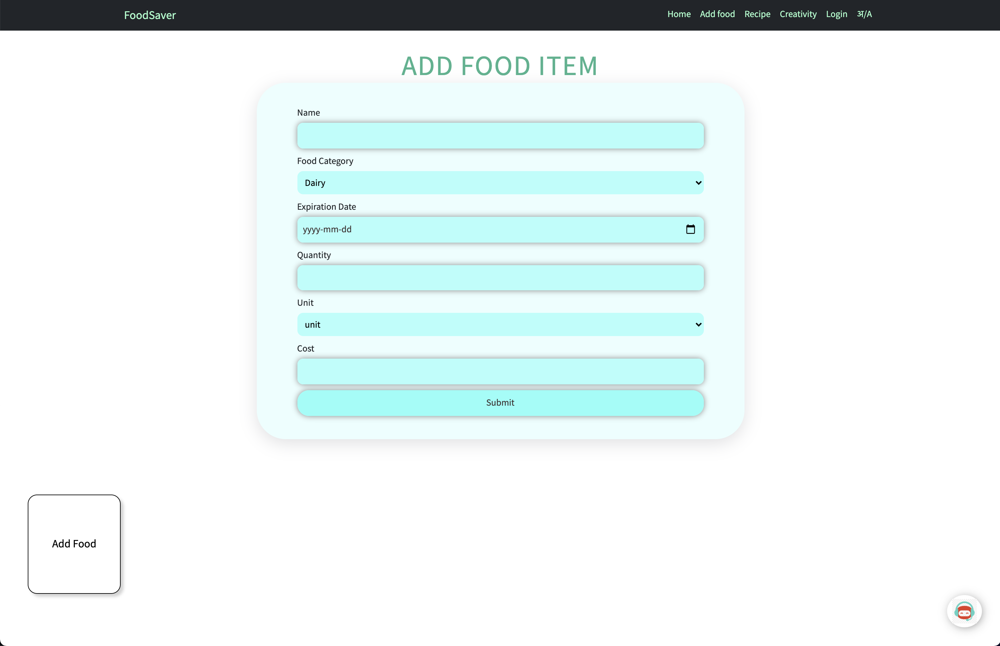
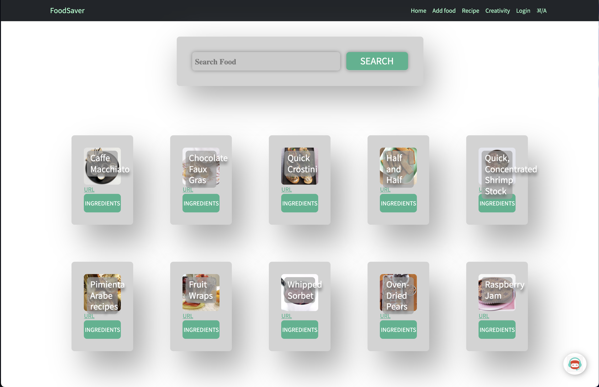
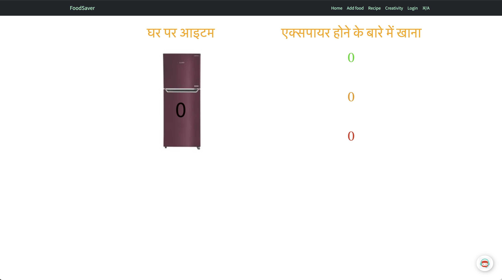
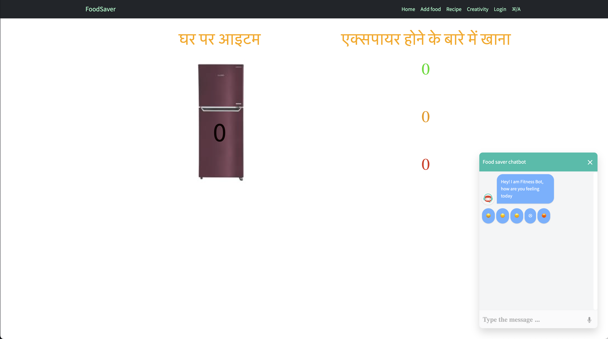

# FoodSaver
About 6% of global greenhouse gas emissions is produced due to wastage of food. This cause global warming, harm environment, wastage of food (which can be feed to poor), wastage of resources, and wastage of money. FoodSaver is a web application that keep track of the food in your house, or restaurant and keep warning you to use the product before it got expire and got waste.

## Screenshots
Home page


Add food item



Recipe Suggestion



Available in Multiple Languages



Smart Chatbot




## Main Features
- Provide a platform for everyone to keep track of the food items.
- Available in Multiple Languages
- Creates a list of edible items present.
- Alerts user to use food item before it got expire.
- Easy to use 
- Custom Scroll bar

## Methodology
- For frontend I have used React Js
- For developing backend I have used Node Js and Express JS.
- For styling we have used CSS and Bootstrap.

## Impact
- Reduces green house emission.
- Easy to keep track of the food.
- Save money wasted on food.
- Saves resources use for producing food.
- Save food.

## Future Scope
- An upload feature where the user can upload their grocery receipt and feed items, and add the product along with the details automatically.
- Building an React Native Application for better experience.
- Making a Cross-platform application for the project.
- Adding alert feature to warn user to use product that is going to expire soon.
- Add a smart chatbot for assistant.


## Prerequisites
Required to install and run the software:

 * [npm](https://www.npmjs.com/get-npm)


## Installing and Running

From the project folder, run these commands in console (terminal) to install dependencies and run the app:
```
1. npm install
2. npm start
```

# 💥 How to Contribute

[](https://github.com/mohit200008/FoodSaver20008/pulls)
[](https://github.com/ellerbrock/open-source-badges/)

- Take a look at the existing [Issues](https://github.com/mohit200008/FoodSaver20008/issues) or [create a new issue](https://github.com/mohit200008/FoodSaver20008/issues/new/choose)!
- [Fork the Repo](https://github.com/mohit200008/FoodSaver20008/fork), create a branch for any issue that you are working on and commit your work.
- Create a **[Pull Request](https://github.com/mohit200008/FoodSaver20008/compare)** (_PR_), which will be promptly reviewed and given suggestions for improvements by the community.
- Add screenshots or screen captures to your Pull Request to help us understand the effects of the changes that are included in your commits.

## ⭐ HOW TO MAKE A PULL REQUEST:

**1.** Start by making a fork the [**FoodSaver20008**](https://github.com/mohit200008/FoodSaver20008) repository. Click on the <a href="https://github.com/mohit200008/FoodSaver20008/fork"></a> symbol at the top right corner.

**2.** Clone your new fork of the repository:

```bash
git clone https://github.com/<your-github-username>/FoodSaver20008
```

**3.** Set upstream command:

```bash
git remote add upstream https://github.com/mohit200008/FoodSaver20008.git
```

**4.** Navigate to the new project directory:

```bash
cd FoodSaver20008
```

**5.** Create a new branch:

```bash
git checkout -b YourBranchName
```

**6.** Sync your fork or local repository with the origin repository:

- In your forked repository click on "Fetch upstream"
- Click "Fetch and merge".

### Alternatively, Git CLI way to Sync forked repository with origin repository:

```bash
git fetch upstream
```

```bash
git merge upstream/main
```

### [Github Docs](https://docs.github.com/en/github/collaborating-with-pull-requests/addressing-merge-conflicts/resolving-a-merge-conflict-on-github) for Syncing

**7.** Make your changes to the source code.

**8.** Stage your changes and commit:

```bash
git add .
```

```bash
git commit -m "<your_commit_message>"
```

**9.** Push your local commits to the remote repository:

```bash
git push origin YourBranchName
```

**10.** Create a [Pull Request](https://help.github.com/en/github/collaborating-with-issues-and-pull-requests/creating-a-pull-request)!

**11.** **Congratulations!** You've made your first contribution! 🙌🏼


## All the best! 🥇

<p align="center">

[](https://github.com/unnati914/Care4ther-)

</p>
